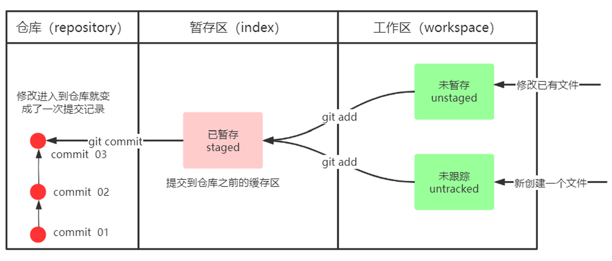

# Git

### 用户信息配置

配置用户名与邮箱

```bash
git config --global user.name "xxx"
git config --global user.email "xxx@xxx.xxx"
```

查看配置的用户名与邮箱

```bash
git config --global user.name
git config --global user.email
```


### 为常用指令配置别名

在用户目录下创建`.bashrc`文件，在`.bashrc`文件中**配置指令别名**

```bash
alias git-log='git log --pretty=oneline --all --graph --abbrev-commit'
alias ll='ls -al'
```


### 基础操作指令

要使用Git对我们的代码进行版本控制，需要**创建本地仓库**

```bash
git init
```

Git工作目录下对于文件的**修改**（增加、删除和更新）会存在几个状态，这些修改的状态会随着我们执行Git的命令而发生变化。



**查看文件状态**

```bash
git status
```

**将修改添加至暂存区**

```bash
# 将工作区中对一个文件的修改添加至暂存区
git add a.txt
# 将当前目录下的所有修改都添加至暂存区
git add .
```

**提交修改**

```bash
git commit -m "comment"
```

**查看提交日志**

```bash
# --all 显示所有分支
# --pretty=oneline 将提交信息显示为一行
# --abbrev-commit 展示简短的commitId
# --graph 以图的形式显示
git log
git reflog
```

**版本回退与切换**

```bash
git reset --hard commitId
```


## 分支

**查看分支**

```bash
git branch
```

**创建分支**

```bash
git branch branchName
```

**切换分支**

```bash
git checkout branchName
git checkout -b branchName # 创建并切换分支
```

合并分支

```bash
```

