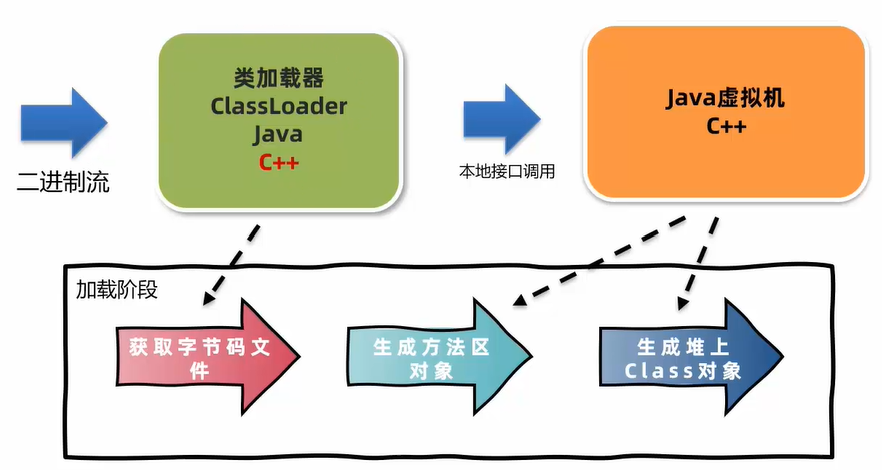
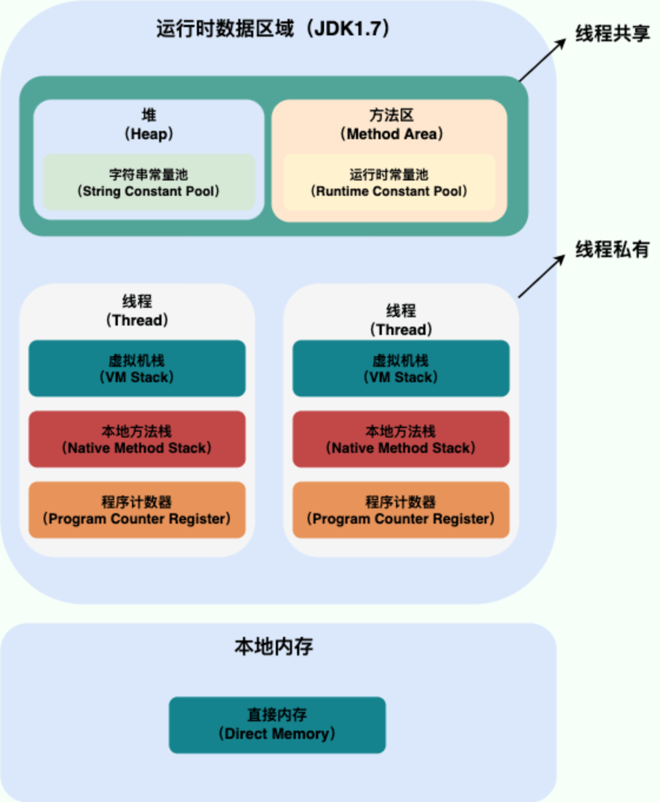
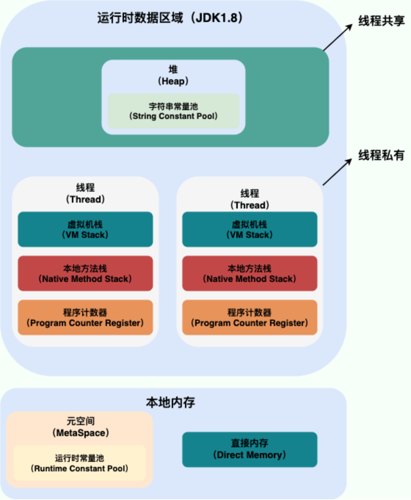
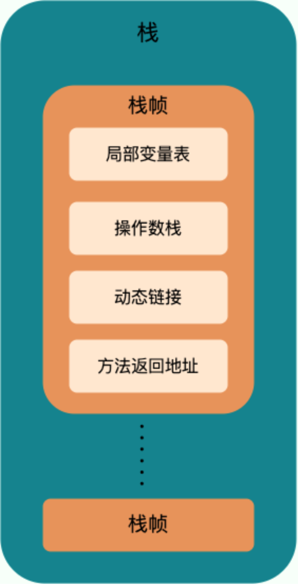
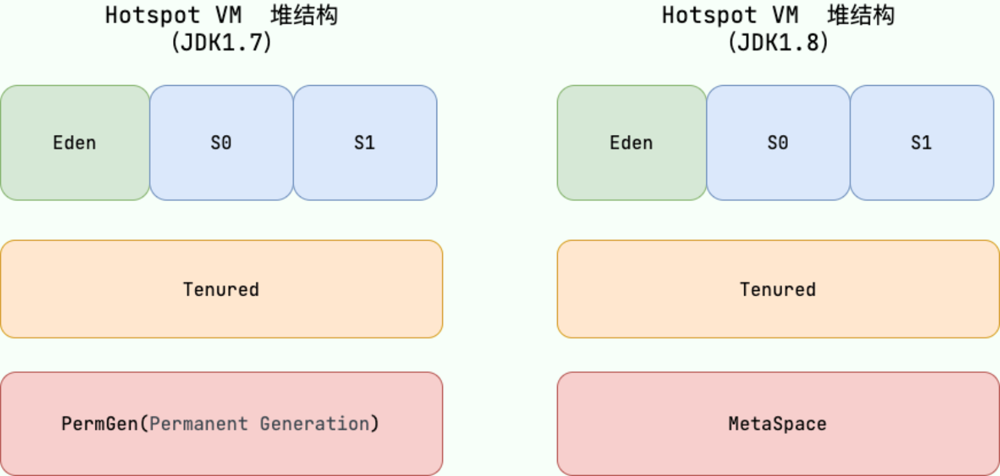
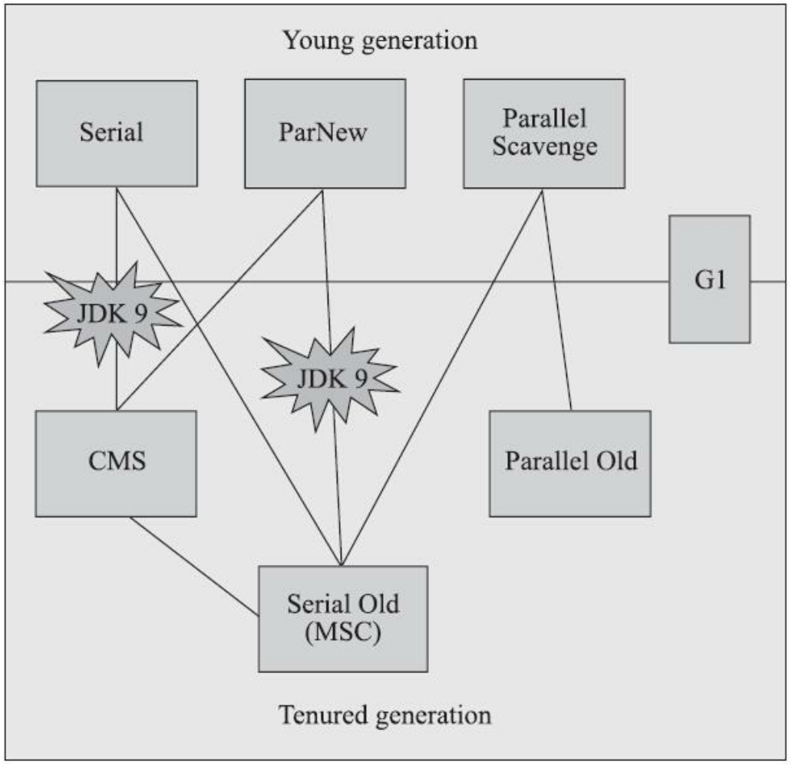
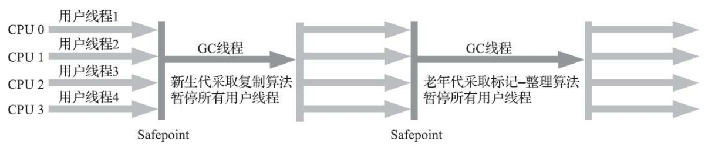
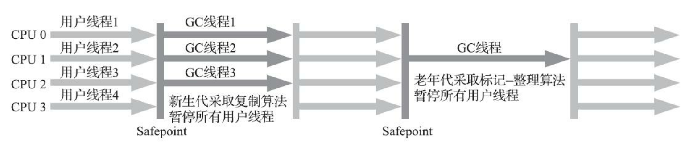

# Java Virtual Machine

JVM的功能：解释和运行、内存管理、以及即时编译。

- **解释和运行**：将字节码文件中的指令实时解释成机器码，让计算机执行。

- **内存管理**：自动为对象、方法等分配内存；自动的垃圾回收机制，回收不再使用的对象。

- **即时编译**（Just-In-Time，JIT）：对热点代码进行优化，提升执行效率。


## 字节码文件

### 1. 字节码文件的组成

字节码文件（.class文件）的主要组成部分如下：

- **基础信息**：魔数（magic，0xCAFEBABE）、版本号（major_version和minor_version）、访问标志（access_flag）等、类索引（this_class）、父类索引（supper_class）等。
- **常量池**（constant_pool）：字符串常量、类或接口名、字段名、方法名等。常量池中的数据都有一个编号，编号从1开始。在字段或者字节码指令中通过编号可以快速的找到对应的数据。在字节码指令中通过编号引用常量池的过程称为**符号引用**。
- **接口**（interfaces）：当前类实现的接口列表。
- **字段**（fields）：当前类或接口声明的字段信息。
- **方法**（methods）：当前类或接口声明的方法信息以及字节码指令。
- **属性**（attributes）：描述当前类或接口所定义的一些属性信息，如源码的文件名、内部类列表等。

```Java
int i = 0, j = 0, k = 0;
// iinc 0 by 1
i++;

// iload_1
// iconst_1
// iadd
// istore_1
j = j + 1;

// iinc 2 by 1
k += 1;
```


## 类的生命周期

### 1. 类的生命周期

类的生命周期描述了一个类**加载**、**连接**、**初始化**、**使用**和**卸载**的整个过程。

#### 1.1 加载阶段

**加载**（loading）阶段第一步是**类加载器**根据类的全限定名通过不同的渠道（本地文件、动态代理生成等）以二进制流的方式获取字节码信息。类加载器在加载完类之后，JVM会在**方法区**中生成一个**InstanceKlass**对象，保存类的所有信息（包含用于实现多态的**虚方法表**）。同时，Java虚拟机还会在**堆**中生成一份与方法区中数据类似的**java.lang.Class**对象，用于在Java代码中获取类的信息以及存储**静态字段**的数据（JDK8及之后）。

为什么存储两份相似的数据？对于开发者来说，只需要访问堆中的Class对象而不需要访问方法区中所有信息。**这样Java虚拟机就能很好地控制开发者访问数据的范围**。

#### 1.2 连接阶段

**连接**（linking）阶段可分为**验证**、**准备**和**解析**三个子阶段。

- **验证**：检测字节码文件是否遵守了《Java虚拟机规范》中的约束。主要包含文件格式验证，元信息验证（如类必须有父类），执行指令语义验证（如方法内的指令不能跳转到不正确的位置）以及符号引用验证（如不能访问其他类中的private方法）。
- **准备**：准备阶段为静态变量分配内存并设置初始值。**准备阶段只会给静态变量赋默认初始值**，int 0，long 0L，short 0，char '\u0000'，byte 0，boolean false，double 0.0，引用数据类型 null。**final修饰的静态变量，且等号右边为字面量（基本数据类型字面量和String字面量），准备阶段直接对变量赋值**。
- **解析**：主要将常量池中的符号引用替换为直接引用。

#### 1.3 初始化阶段

**初始化**（initialization）阶段**为静态变量赋值**并**执行静态代码块中的代码**。初始化阶段会执行字节码文件中clinit部分的字节码指令，clinit方法中字节码的执行顺序与Java源代码中的顺序是一致的（为静态变量赋值的字节码也包含在clinit方法中）。

以下几种方式会导致类的初始化：

- 访问一个类的静态变量或者静态方法，若变量是final修饰并且等号右边是常量不会触发初始化；
- 调用Class.forName(String className)；
- new一个该类的对象时；
- 执行main方法的当前类。

clinit方法在特定的情况下不会出现：

- 无静态代码块且无静态变量赋值语句；
- 有静态变量的声明，但是没有赋值语句；
- 有赋值语句，但是变量使用final修饰且等号右边为字面量。

注：

- 访问子类中的父类静态变量，不会触发子类的初始化。
- 子类的初始化clinit调用之前，会先调用父类的clinit方法。
- 数组的创建不会导致数组中元素的类进行初始化。
- final修饰的变量如果赋值的内容需要执行指令才能得到结果，会执行clinit方法进行初始化。

#### 1.4 使用阶段

#### 1.5 卸载阶段

判定一个类可以被卸载，需要同时满足三个条件：此类的所有实例对象都已经被回收，在堆中不存在任何该类的实例对象以及子类对象；加载该类的类加载器已经被回收；该类对应的`java.lang.Class`对象没有在任何地方被引用。


### 2. 类加载器

**类加载器**（ClassLoader）是Java虚拟机提供给应用程序获取类和接口字节码数据的技术。 类加载器只参与加载过程中的字节码获取和字节码加载到内存。



#### 2.1 JDK8及之前版本的类加载器

**2.1.1 类加载器的分类**

类加载器分为两类，一类是Java虚拟机底层源代码实现的，一类是Java代码实现的。虚拟机底层源代码实现的类加载器（BootstrapClassLoader）加载程序运行时的基础类。Java代码实现的类加载器（ExtClassLoader，AppClassLoader，自定义类加载器）都继承自**ClassLoader抽象类**，用于加载Java中通用的类或者应用程序使用的类。

**启动类加载器**（BootstrapClassLoader）是由Hotspot虚拟机提供的，使用C++编写的类加载器。**启动类加载器默认加载目录`/jre/lib`下的类文件**。若需通过启动类加载器加载用户jar包，可通过虚拟机参数`-Xbootclasspath/a:jar包目录/jar包名`进行拓展。

**拓展类加载器**（ExtClassLoader）和**应用程序类加载器**（AppClassLoader）都是使用Java编写的类加载器。这两个类加载器是sun.misc.Launcher的静态内部类，继承自URLClassLoader。**拓展类加载器默认加载目录`jre/lib/ext`下的类文件**。若需通过拓展类加载器加载用户jar包，可通过虚拟机参数`-Djava.ext.dirs=jar包目录`，这种方式会覆盖掉原始目录，可以用 ; （windows）或 : （macos/linux）追加上原始目录。**应用程序类加载器加载classpath下的类文件**。

**2.1.2 使用代码主动加载类**

在Java中可以用如下两种方式主动加载一个类：

- 使用Class.forName方法，使用当前类的类加载器加载指定的类。
- 获取类加载器，通过类加载器的loadClass方法加载指定的类。

**2.1.3 类加载器的双亲委派机制**

每个Java实现的类加载器中都保存了一个成员变量parent，表示父类加载器（非继承关系）。应用程序类加载器的parent类加载器是拓展类加载器，拓展类加载器的parent为空。启动类加载器使用C++编写，没有父类加载器。

**双亲委派机制**（Parent Delegation Mechanism）：在类加载的过程中，每个类加载器都会先检查是否已经加载了该类，如果已经加载则直接返回，否则会将加载请求委派给父类加载器。如果类加载的parent为null，则会提交给启动类加载器处理。如果所有的父类加载器都无法加载该类，则由当前类加载器尝试加载。第二次再去加载相同的类，仍然会向上进行委派，如果某个类加载器加载过就会直接返回。双亲委派机制指的是：自底向上查找是否加载过，再由顶向下进行加载。

- 如果一个类出现在三个类加载器的加载位置，应该由谁来加载？根据双亲委派机制，启动类加载器的优先级是最高的，由启动类加载器加载。
- String类能覆盖吗？不能，启动类加载器会加载`rt.jar`包中的String类。

双亲委派机制的作用：保证类加载的安全性，启动类加载器负责加载核心类，避免恶意代码替换JDK中的核心类库；避免重复加载，上层的类加载器如果加载过某个类，就会直接返回该类，避免重复加载。

双亲委派机制相关**源代码**：

ClassLoader中包含如下几个核心方法：

```Java
public Class<?> loadClass(String name) throws ClassNotFoundException {
    return loadClass(name, false);
}

protected Class<?> loadClass(String name, boolean resolve)
    throws ClassNotFoundException
{
    synchronized (getClassLoadingLock(name)) {
        // First, check if the class has already been loaded
        Class<?> c = findLoadedClass(name);
        if (c == null) {
            long t0 = System.nanoTime();
            try {
                if (parent != null) {
                    c = parent.loadClass(name, false);
                } else {
                    c = findBootstrapClassOrNull(name);
                }
            } catch (ClassNotFoundException e) {
                    // ClassNotFoundException thrown if class not found
                    // from the non-null parent class loader
            }

            if (c == null) {
                // If still not found, then invoke findClass in order
                // to find the class.
                long t1 = System.nanoTime();
                c = findClass(name);

                // this is the defining class loader; record the stats
                sun.misc.PerfCounter.getParentDelegationTime().addTime(t1 - t0);
                sun.misc.PerfCounter.getFindClassTime().addElapsedTimeFrom(t1);
                sun.misc.PerfCounter.getFindClasses().increment();
            }
        }
        if (resolve) {
            resolveClass(c);
        }
        return c;
    }
}

// Finds the class with the specified binary name. This method should be overridden
// by class loader implementations that follow the delegation model for loading classes,
// and will be invoked by the loadClass method after checking the parent class loader
// for the requested class. The default implementation throws a ClassNotFoundException.
protected Class<?> findClass(String name) throws ClassNotFoundException


// Converts an array of bytes into an instance of class Class. Before the Class can be
// used it must be resolved.
protected final Class<?> defineClass(String name， byte[] b, int off, int len) throws ClassFormatError

// Links the specified class. This (misleadingly named) method may be used by a class
// loader to link a class. If the class c has already been linked, then this method simply
// returns. Otherwise, the class is linked as described in the "Execution" chapter of The
// Java™ Language Specification.
protected final void resolveClass(Class<?> c)
```

**2.1.4 自定义类加载器**

正确地实现一个自定义类加载器的方式是重写findClass方法，这样不会破坏双亲委派机制。若想打破双亲委派机制，需实现自定义类加载器并且重写loadClass方法，将双亲委派机制的代码去除。Tomcat使用这种方式实现应用之间的类隔离。

```Java
import org.apache.commons.io.IOUtils;

import java.io.File;
import java.io.FileInputStream;
import java.io.IOException;
import java.io.InputStream;
import java.nio.charset.StandardCharsets;
import java.security.ProtectionDomain;
import java.util.regex.Matcher;

public class BreakClassLoader extends ClassLoader{
    private String basePath;
    private final static String FILE_EXT = ".class";
    
    public void setBasePath(String basePath) {
        this.basePath = basePath;
    }
    
    private byte[] loadClassData(String name) {
        try {
            String tempName = name.replaceAll("\\.", Matcher.quoteReplacement(File.separator));
            FileInputStream fis = new FileInputStream(basePath + tempName + FILE_EXT);
            try {
                return IOUtils.toByteArray(fis);
            } finally {
                IOUtils.closeQuietly(fis);
            }

        } catch (Exception e) {
            System.out.println("自定义类加载器加载失败：" + e.getMessage());
            return null;
        }
    }
    
    @Override
    public Class<?> loadClass(String name) throws ClassNotFoundException {
        if(name.startsWith("java.")) {
            return super.loadClass(name);
        }
        byte[] data = loadClassData(name);
        return defineClass(name, data, 0, data.length);
    }

    public static void main(String[] args) throws Exception {
        BreakClassLoader classLoader = new BreakClassLoader();
        classLoader.setBasePath("");
        Class<?> clazz1 = classLoader.loadClass("com.example.A");
     }
}
```

- 两个自定义类加载器加载相同限定名的类，会冲突吗？不会冲突，在同一个Java虚拟机中，只有相同类加载器+相同的类限定名才会被认为是同一个类。

#### 2.2 JDK9及之后版本的类加载器

[内容]


## Java内存区域

Java虚拟机在运行Java程序过程中管理的内存区域，称之为**运行时数据区**。Java虚拟机在执行Java程序的过程中会把它管理的内存划分成若干个不同的数据区域。

<div style="display: flex; justify-content: center; gap: 10px;">
    
    
</div>
- **程序计数器**：每个线程会通过程序计数器记录将要执行的字节码指令的地址；顺序执行、分支、循环、跳转、异常处理、线程恢复等功能都需要依赖程序计数器完成。

- **Java虚拟机栈和本地方法栈**：Java采用栈的结构管理方法调用中的数据，每一个方法调用使用一个栈帧来保存。Java虚拟机栈和本地方法栈随着线程的创建而创建，在线程销毁时回收。每个栈帧中都包含：局部变量表、操作数栈、动态链接和方法返回地址。虚拟机栈为虚拟机执行Java方法服务，本地方法栈为虚拟机用到的native方法服务，在HotSpot虚拟机中虚拟机栈和本地方法栈共享同一个栈空间。

  

  **局部变量表**存放了方法执行过程中的所有局部变量（this、方法的参数、方法体中声明的局部变量），源文件编译成字节码文件时就可以确定局部变量表的内容；栈帧中的局部变量表是一个数组，数组中的每一个位置称为槽（slot），long和double类型占用两个槽，其他类型占用一个槽；为了节省空间，局部变量表中的槽式可以复用的，一旦某个局部变量不再生效，槽就可以再次被使用。

  **操作数栈**是虚拟机在执行指令的过程中用来存放中间数据的一块区域，是栈的结构，如果一条指令将一个值压入操作数栈，则后面的指令可以弹出并使用该值；操作数栈的最大深度在编译器就可以确定。

  当字节码指令引用了其他类的属性或方法时，需要将符号引用转换成对应的运行时常量池中的地址，**动态链接**就保存了符号引用到运行时常量池中地址的映射。

  **方法返回地址指**的是方法在正确或异常结束时，当前栈帧被弹出后，程序计数器应该指向上一个栈中的下一条将要执行指令的地址。

  **异常表**存放异常处理相关信息，包括异常捕获的生效范围以及异常发生后跳转到的字节码指令位置。

  可以使用**参数`-Xss`设置虚拟机栈的大小**，后跟字节数（必须是1024的倍数）、k或者K、m或者M、g或者G，如`-Xss1m`。也可以使用`-XX:ThreadStackSize`配置栈大小，如``-XX:ThreadStackSize=1024`。

- **方法区**：方法区是JVM运行时数据区的一块逻辑区域，是各个线程共享的内存区域。方法区会存储类的**元信息**、**运行时常量池**和**字符串常量池**（JDK1.7以前）。永久代（JDK1.7及之前）和元空间（JDK1.8及之后）是HotSpot虚拟机对方法区的两种实现方式。可以**使用 `-XX：MaxMetaspaceSize` 标志设置最大元空间大小**，默认值为 unlimited。

- **运行时常量池**：字节码文件中有存放编译期生成的字面量和符号引用的常量池表。常量池表会在类加载后放到方法区的运行时常量池中。

- **字符串常量池**：JDK1.7之前，字符串常量池存放在永久代，JDK1.7字符串常量池移动到了堆中。

- **堆**：堆是所有线程共享的一块内存区域，几乎所有的对象实例以及数组都在堆分配内存。从JDK1.7开始默认开启逃逸分析，如果某些方法中的对象引用没有被返回或者未被外面使用，那么对象可能直接在栈上分配内存。Java堆是垃圾收集管理的主要区域，因此也被称作GC堆。使用**参数`-Xms`设置堆的初始大小**，**参数`-Xmx`设置堆的最大大小**。**JDK8之后永久代已被元空间取代，元空间使用的是本地内存**。

- **直接内存**：直接内存并不是虚拟机运行时数据区的一部分，也不是虚拟机规范中定义的内存区域。JDK1.4 加入的 NIO引入了一种基于通道与缓存区的 I/O 方式，它可以直接使用 Native 函数直接分配堆外内存，然后通过一个存储在 Java 堆中的 DirectByteBuffer 对象作为这块内存的引用进行操作。这样就能在一些场景中显著提高性能，避免了在 Java 堆和 Native 堆之间来回复制数据。使用**参数`-XX:MaxDirectMemorySize`设置直接内存的大小**。

  


## 垃圾回收

Java的自动内存管理主要是针对堆中对象内存的分配和回收。

### 1. 引用计数法和可达性分析

对堆中垃圾回收的第一步是判断哪些对象已经死亡。判断对象死亡有两种方法：引用计数法和可达性分析。

**引用计数法**：为每一个对象添加一个引用计数器，当对象被引用时加1，取消引用时减1，任何时候计数器为0的对象就是可以回收的。引用计数法实现简单，但存在缺点：每次引用和取消引用都需要维护计数器，对系统性能有一定影响；存在循环引用时无法回收对象。

**可达性分析算法**：Java使用的是可达性分析算法判断对象是否可以被回收。 可达性分析算法从作为GC Roots的对象为起点，从这些节点开始搜索，所走过的路径称为引用链，当一个对象到GC Roots没有引用链相连的话，次对象是可以被回收的。GC Roots对象：虚拟机栈（栈帧中的局部变量表）中引用的对象、本地方法栈中引用的对象、 系统类加载器加载的java.lang.Class对象（因此静态变量引用的对象是不可回收的）、监视器对象（用于同步锁synchronized）以及本地方法调用时使用的全局对象（JNI Global）。

### 2. 引用类型

Java中的引用分为强引用、软引用、弱引用和虚引用。

**强引用**（StrongReference）：强引用是默认的引用类型，如果一个对象有强引用，垃圾回收器绝对不会回收它。

**软引用**（SoftReference）：如果一个对象只有软引用关联到它，那么当程序内存不足时，就会将软引用关联的对象回收，软引用常用于缓存中。软引用可以和一个引用队列（ReferenceQueue）联合使用，如果软引用所引用的对象被垃圾回收，虚拟机就会把这个软引用加入到与之关联的引用队列中。

**弱引用**（WeakReference）：如果一个对象只有弱引用关联到它，不管当前内存空间是否足够，都会将弱引用关联的对象回收。弱应用也可以和一个引用队列联合使用。

**虚引用**（PhantomReference）：虚引用主要用来跟踪对象被垃圾回收的活动，不能通过虚引用对象获取到包含的对象，虚引用必须和引用队列联合使用。

### 3. 垃圾收集算法

**标记-清除算法**（Mark-and-Sweep）：在标记阶段对所有存活对象进行标记，在清除阶段回收掉所有没有被标记的对象。标记-清除算法实现简单，但会产生内存碎片，并且需要维护空闲列表用于内存分配，内存分配速度较慢。

**复制算法**（Copying）：将内存分为大小相同的两块（From空间和To空间），每次使用其中的一块。在垃圾回收阶段，将存活对象从From空间复制到To空间；清理From空间，将两块空间名称互换。复制算法只需要遍历一次存活对象并复制到To空间即可，吞吐量高且不存在内存碎片化的问题；然后复制算法的内存效率低，每次只能使用一半的内存空间。Appel式回收是一种更优化的复制策略，具体做法是把新生代分为一块较大的Eden空间和两块较小的Survivo空间，每次分配内存只使用Eden和其中一块Survivor，发生垃圾收集时，将Eden和Survivor中仍然存活的对象一次性复制到另一外Survivor空间上，然后直接清理掉Eden和已用过的那块Survivor空间。当Survivor空间不足以容纳一次Minor GC之后存活的对象时，就需要依赖老年代进行**分配担保**（Handle Promotion）。

**标记-整理算法**（Mark-and-Compact）：在标记阶段对所有存活对象进行标记，在整理阶段将存活对象移动到堆的一端，然后清理边界之外的内存。标记整理算法的内存使用效率高，不会发生碎片化的问题，然而整理阶段的效率不高。标记整理算法是一种移动式垃圾收集算法，它需要移动存活对象并更新所有这些对象的地方。这种对象移动操作必须全程暂停用户程序才能进行。

**分代收集理论**：当前的大多数垃圾收集器都遵循了分代收集的理论进行设计。分代收集理论建立在三个假说之上：**弱分代假说**，绝大多数对象都是朝生夕灭的；**强分代假说**，熬过越多次垃圾收集过程的对象就越难以消亡；**跨代引用假说**，跨代引用相对于同代引用来说仅占极少数。Java堆被划分成不同的区域，垃圾收集器可以每次只回收其中某一个或某些部分区域，同时能够针对不同的区域安排与里面存储对象存亡特征相匹配的垃圾收集算法。针对少量的跨代引用，垃圾收集器需要在新生代上建立一个全局的数据结构**记忆集**（Remembered Set），这个结构把老年代划分成若干个小块，标识出老年代的哪一块内存会存在跨代引用。

### 4. HotSpot的算法细节实现

#### 4.1 根节点枚举

目前主流Java虚拟机使用的都是**准确式垃圾收集**，垃圾收集器在根节点枚举这一步并不需要一个不漏地检查所有执行上下文和全局引用的位置，虚拟机有办法直接得到哪些地方存放着对象引用。HotSpot使用一组称为**OopMap**的数据结构来达到这个目的，类加载完成的时候，HotSpot会把对象内什么偏移量上是什么类型的数据计算出来，在即时编译的过程中，也会在特定的位置记录下栈里和寄存器里哪些位置是引用。这样收集器在扫描时就可以直接得知这些信息。

#### 4.2 安全点

在OopMap的协助下，HotSpot可以快速准确地完成GC Roots枚举，然而导致OopMap内容变化的指令非常多，如果为每一条指令都声称对应的OopMap，那将会需要大量的额外存储空间。HotSpot没有为每条指令都生成OopMap，只是在“特定的位置”记录了这些信息，这些位置被称为**安全点**（Safepoint）。用户程序执行时并非在代码指令流的任意位置都能停顿下来开始垃圾收集，而是必须执行到达安全点后才能够暂停。HotSpot采用了**主动式中断**的方案在垃圾收集发生时让所有线程都跑到最近的安全点：当垃圾收集需要中断线程的时候，不直接对线程操作，而是设置一个标志位，各个线程执行过程时会不停地主动去轮询这个标志，一旦发现中断标志为真时就在自己最近的安全点上主动中断挂起，轮询序标志的地方和安全点是重合的。

由于轮询操作在代码中会频繁出现， 这要求它必须足够高效。 HotSpot使用内存保护陷阱的方式，把轮询操作精简至只有一条汇编指令的程度。 举一个例子：`0x01b6d62d: test %eax,0x160100` 中的test指令就是HotSpot生成的轮询指令， 当需要暂停用户线程时， 虚拟机把0x160100的内存页设置为不可读，线程执行到test指令时就会产生一个自陷异常信号， 然后在预先注册的异常处理器中挂起线程实现等待， 这样仅通过一条汇编指令便完成安全点轮询和触发线程中断了。

#### 4.3 安全区域

安全点机制保证了程序执行时， 在不太长的时间内就会遇到可进入垃圾收集过程的安全点。 但是， 程序“不执行”的时候（没有分配处理器时间）， 如用户线程处于Sleep状态或者Blocked状态， 这时候线程无法响应虚拟机的中断请求， 不能再走到安全的地方去中断挂起自己， 虚拟机也显然不可能持续等待线程重新被激活分配处理器时间。 对于这种情况， 就必须引入**安全区域**（Safe Region） 来解决。安全区域是指能够确保在某一段代码片段之中， 引用关系不会发生变化， 因此， 在这个区域中任意地方开始垃圾收集都是安全的，可以把安全区域看作被扩展拉伸了的安全点。当用户线程执行到安全区域里面的代码时， 首先会标识自己已经进入了安全区域， 那样当这段时间里虚拟机要发起垃圾收集时就不必去管这些已声明自己在安全区域内的线程了。 当线程要离开安全区域时， 它要检查虚拟机是否已经完成了根节点枚举（或者垃圾收集过程中其他需要暂停用户线程的阶段） ， 如果完成了， 那线程就当作没事发生过， 继续执行； 否则它就必须一直等待， 直到收到可以离开安全区域的信号为止。

### 5. 垃圾收集器



上图展示了七种作用于不同分代的收集器（JDK11及之前）， 如果两个收集器之间存在连线， 就说明它们可以搭配使用。

在谈论垃圾收集器的语境中，并发和并行可以理解为：**并行**（Parallel）描述的是多条垃圾收集器线程之间的关系， 说明同一时间有多条这样的线程在协同工作， 通常默认此时用户线程是处于等待状态；**并发**（Concurrent） 描述的是垃圾收集器线程与用户线程之间的关系， 说明同一时间垃圾收集器线程与用户线程都在运行， 由于用户线程并未被冻结， 所以程序仍然能响应服务请求， 但由于垃圾收集器线程占用了一部分系统资源， 此时应用程序的处理的吞吐量将受到一定影响。

#### 5.1 Serial收集器



上图展示了Serial/Serial Old收集器的运行过程。Serial是一个单线程工作的垃圾收集器，只使用一条收集线程去完成垃圾收集工作，并且Serial进行垃圾收集时，必须暂停其他所有的工作线程知道收集结束。Serial采用复制算法对新生代进行垃圾回收。Serial垃圾收集器适用于内存资源受限或单核处理器或处理器核心数较少的环境，有最高的单线程收集效率。

#### 5.2 Serial Old收集器

Serial Old是Serial收集器的老年代版本，它同样是一个单线程收集器，使用标记-整理算法。Serial Old作为CMS收集器发生失败时的后备预案，在并发收集发生Concurrent Mode Failure时使用。

#### 5.3 ParNew收集器



上图展示了ParNew/Serial Old收集器的运行过程。ParNew收集器是Serial收集器的多线程并行版本。除了Serial收集器外，只有ParNew能与CMS收集器配合工作。ParNew收集器是激活CMS后（使用`-XX: +UseConcMarkSweepGC`选项） 的默认新生代收集器， 也可以使用`-XX: +/-UseParNewGC`选项来强制指定或者禁用它。ParNew收集器默认开启的收集线程数与处理器核心数量相同， 在处理器核心非常多的环境中， 可以使用`-XX: ParallelGCThreads`参数来限制垃圾收集的线程数。

#### 5.4 Parallel Scavenge收集器

Parallel Scavenge收集器是一款基于标记-复制算法实现的并行新生代收集器。Parallel Scavenge收集器的目标则是达到一个可控制的吞吐量（Throughput） 。吞吐量即处理器用于运行用户代码的时间与处理器总消耗时间的比值。停顿时间越短就越适合需要与用户交互或需要保证服务响应质量的程序， 良好的响应速度能提升用户体验； 而高吞吐量则可以最高效率地利用处理器资源， 尽快完成程序的运算任务， 主要适合在后台运算而不需要太多交互的分析任务。

Parallel Scavenge收集器提供了两个参数用于精确控制吞吐量， 分别是控制最大垃圾收集停顿时间的`-XX: MaxGCPauseMillis`参数以及直接设置吞吐量大小的`-XX: GCTimeRatio`参数。
