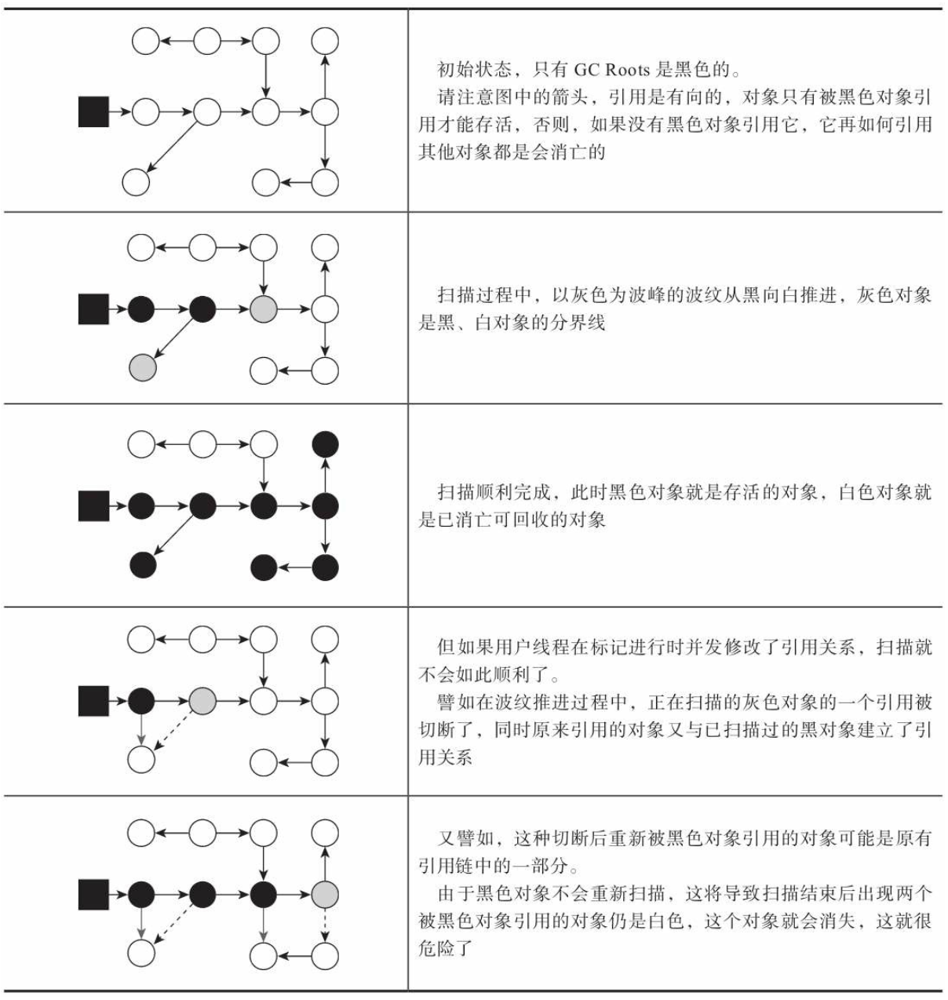
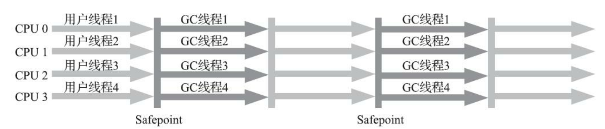
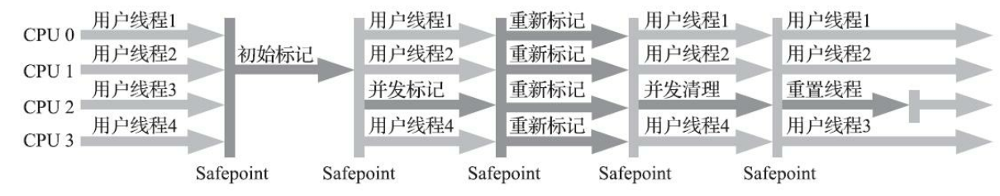
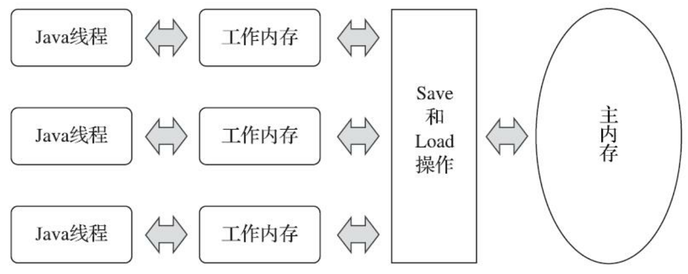

# Java Virtual Machine

JVM的功能：解释和运行、内存管理、以及即时编译。

- **解释和运行**：将字节码文件中的指令实时解释成机器码，让计算机执行。

- **内存管理**：自动为对象、方法等分配内存；自动的垃圾回收机制，回收不再使用的对象。

- **即时编译**（Just-In-Time，JIT）：对热点代码进行优化，提升执行效率。


## 字节码文件

### 1. 字节码文件的组成

字节码文件（.class文件）的主要组成部分如下：

- **基础信息**：魔数（magic，0xCAFEBABE）、版本号（major_version和minor_version）、访问标志（access_flag）等、类索引（this_class）、父类索引（supper_class）等。
- **常量池**（constant_pool）：字符串常量、类或接口名、字段名、方法名等。常量池中的数据都有一个编号，编号从1开始。在字段或者字节码指令中通过编号可以快速的找到对应的数据。在字节码指令中通过编号引用常量池的过程称为**符号引用**。
- **接口**（interfaces）：当前类实现的接口列表。
- **字段**（fields）：当前类或接口声明的字段信息。
- **方法**（methods）：当前类或接口声明的方法信息以及字节码指令。
- **属性**（attributes）：描述当前类或接口所定义的一些属性信息，如源码的文件名、内部类列表等。

```Java
int i = 0, j = 0, k = 0;
// iinc 0 by 1
i++;

// iload_1
// iconst_1
// iadd
// istore_1
j = j + 1;

// iinc 2 by 1
k += 1;
```


## 类的生命周期

### 1. 类的生命周期

类的生命周期描述了一个类**加载**、**连接**、**初始化**、**使用**和**卸载**的整个过程。

#### 1.1 加载阶段

**加载**（loading）阶段第一步是**类加载器**根据类的全限定名通过不同的渠道（本地文件、动态代理生成等）以二进制流的方式获取字节码信息。类加载器在加载完类之后，JVM会在**方法区**中生成一个**InstanceKlass**对象，保存类的所有信息（包含用于实现多态的**虚方法表**）。同时，Java虚拟机还会在**堆**中生成一份与方法区中数据类似的**java.lang.Class**对象，用于在Java代码中获取类的信息以及存储**静态字段**的数据（JDK8及之后）。

为什么存储两份相似的数据？对于开发者来说，只需要访问堆中的Class对象而不需要访问方法区中所有信息。**这样Java虚拟机就能很好地控制开发者访问数据的范围**。

#### 1.2 连接阶段

**连接**（linking）阶段可分为**验证**、**准备**和**解析**三个子阶段。

- **验证**：检测字节码文件是否遵守了《Java虚拟机规范》中的约束。主要包含文件格式验证，元信息验证（如类必须有父类），执行指令语义验证（如方法内的指令不能跳转到不正确的位置）以及符号引用验证（如不能访问其他类中的private方法）。
- **准备**：准备阶段为静态变量分配内存并设置初始值。**准备阶段只会给静态变量赋默认初始值**，int 0，long 0L，short 0，char '\u0000'，byte 0，boolean false，double 0.0，引用数据类型 null。**final修饰的静态变量，且等号右边为字面量（基本数据类型字面量和String字面量），准备阶段直接对变量赋值**。
- **解析**：主要将常量池中的符号引用替换为直接引用。

#### 1.3 初始化阶段

**初始化**（initialization）阶段**为静态变量赋值**并**执行静态代码块中的代码**。初始化阶段会执行字节码文件中clinit部分的字节码指令，clinit方法中字节码的执行顺序与Java源代码中的顺序是一致的（为静态变量赋值的字节码也包含在clinit方法中）。

以下几种方式会导致类的初始化：

- 访问一个类的静态变量或者静态方法，若变量是final修饰并且等号右边是常量不会触发初始化；
- 调用Class.forName(String className)；
- new一个该类的对象时；
- 执行main方法的当前类。

clinit方法在特定的情况下不会出现：

- 无静态代码块且无静态变量赋值语句；
- 有静态变量的声明，但是没有赋值语句；
- 有赋值语句，但是变量使用final修饰且等号右边为字面量。

注：

- 访问子类中的父类静态变量，不会触发子类的初始化。
- 子类的初始化clinit调用之前，会先调用父类的clinit方法。
- 数组的创建不会导致数组中元素的类进行初始化。
- final修饰的变量如果赋值的内容需要执行指令才能得到结果，会执行clinit方法进行初始化。

#### 1.4 使用阶段

#### 1.5 卸载阶段

判定一个类可以被卸载，需要同时满足三个条件：此类的所有实例对象都已经被回收，在堆中不存在任何该类的实例对象以及子类对象；加载该类的类加载器已经被回收；该类对应的`java.lang.Class`对象没有在任何地方被引用。

### 2. 类加载器

**类加载器**（ClassLoader）是Java虚拟机提供给应用程序获取类和接口字节码数据的技术。类加载器只参与加载过程中的字节码获取和字节码加载到内存。


#### 2.1 JDK8及之前版本的类加载器

**2.1.1 类加载器的分类**

类加载器分为两类，一类是Java虚拟机底层源代码实现的，一类是Java代码实现的。虚拟机底层源代码实现的类加载器（BootstrapClassLoader）加载程序运行时的基础类。Java代码实现的类加载器（ExtClassLoader，AppClassLoader，自定义类加载器）都继承自**ClassLoader抽象类**，用于加载Java中通用的类或者应用程序使用的类。

**启动类加载器**（BootstrapClassLoader）是由Hotspot虚拟机提供的，使用C++编写的类加载器。**启动类加载器默认加载目录`/jre/lib`下的类文件**。若需通过启动类加载器加载用户jar包，可通过虚拟机参数`-Xbootclasspath/a:jar包目录/jar包名`进行拓展。

**拓展类加载器**（ExtClassLoader）和**应用程序类加载器**（AppClassLoader）都是使用Java编写的类加载器。这两个类加载器是sun.misc.Launcher的静态内部类，继承自URLClassLoader。**拓展类加载器默认加载目录`jre/lib/ext`下的类文件**。若需通过拓展类加载器加载用户jar包，可通过虚拟机参数`-Djava.ext.dirs=jar包目录`，这种方式会覆盖掉原始目录，可以用 ; （windows）或 : （macos/linux）追加上原始目录。**应用程序类加载器加载classpath下的类文件**。

**2.1.2 使用代码主动加载类**

在Java中可以用如下两种方式主动加载一个类：

- 使用Class.forName方法，使用当前类的类加载器加载指定的类。
- 获取类加载器，通过类加载器的loadClass方法加载指定的类。

**2.1.3 类加载器的双亲委派机制**

每个Java实现的类加载器中都保存了一个成员变量parent，表示父类加载器（非继承关系）。应用程序类加载器的parent类加载器是拓展类加载器，拓展类加载器的parent为空。启动类加载器使用C++编写，没有父类加载器。

**双亲委派机制**（Parent Delegation Mechanism）：在类加载的过程中，每个类加载器都会先检查是否已经加载了该类，如果已经加载则直接返回，否则会将加载请求委派给父类加载器。如果类加载的parent为null，则会提交给启动类加载器处理。如果所有的父类加载器都无法加载该类，则由当前类加载器尝试加载。第二次再去加载相同的类，仍然会向上进行委派，如果某个类加载器加载过就会直接返回。双亲委派机制指的是：自底向上查找是否加载过，再由顶向下进行加载。

- 如果一个类出现在三个类加载器的加载位置，应该由谁来加载？根据双亲委派机制，启动类加载器的优先级是最高的，由启动类加载器加载。
- String类能覆盖吗？不能，启动类加载器会加载`rt.jar`包中的String类。

双亲委派机制的作用：保证类加载的安全性，启动类加载器负责加载核心类，避免恶意代码替换JDK中的核心类库；避免重复加载，上层的类加载器如果加载过某个类，就会直接返回该类，避免重复加载。

双亲委派机制相关**源代码**：

ClassLoader中包含如下几个核心方法：

```Java
public Class<?> loadClass(String name) throws ClassNotFoundException {
    return loadClass(name, false);
}

protected Class<?> loadClass(String name, boolean resolve)
    throws ClassNotFoundException
{
    synchronized (getClassLoadingLock(name)) {
        // First, check if the class has already been loaded
        Class<?> c = findLoadedClass(name);
        if (c == null) {
            long t0 = System.nanoTime();
            try {
                if (parent != null) {
                    c = parent.loadClass(name, false);
                } else {
                    c = findBootstrapClassOrNull(name);
                }
            } catch (ClassNotFoundException e) {
                    // ClassNotFoundException thrown if class not found
                    // from the non-null parent class loader
            }

            if (c == null) {
                // If still not found, then invoke findClass in order
                // to find the class.
                long t1 = System.nanoTime();
                c = findClass(name);

                // this is the defining class loader; record the stats
                sun.misc.PerfCounter.getParentDelegationTime().addTime(t1 - t0);
                sun.misc.PerfCounter.getFindClassTime().addElapsedTimeFrom(t1);
                sun.misc.PerfCounter.getFindClasses().increment();
            }
        }
        if (resolve) {
            resolveClass(c);
        }
        return c;
    }
}

// Finds the class with the specified binary name. This method should be overridden
// by class loader implementations that follow the delegation model for loading classes,
// and will be invoked by the loadClass method after checking the parent class loader
// for the requested class. The default implementation throws a ClassNotFoundException.
protected Class<?> findClass(String name) throws ClassNotFoundException


// Converts an array of bytes into an instance of class Class. Before the Class can be
// used it must be resolved.
protected final Class<?> defineClass(String name， byte[] b, int off, int len) throws ClassFormatError

// Links the specified class. This (misleadingly named) method may be used by a class
// loader to link a class. If the class c has already been linked, then this method simply
// returns. Otherwise, the class is linked as described in the "Execution" chapter of The
// Java™ Language Specification.
protected final void resolveClass(Class<?> c)
```

**2.1.4 自定义类加载器**

正确地实现一个自定义类加载器的方式是重写findClass方法，这样不会破坏双亲委派机制。若想打破双亲委派机制，需实现自定义类加载器并且重写loadClass方法，将双亲委派机制的代码去除。Tomcat使用这种方式实现应用之间的类隔离。

```Java
import org.apache.commons.io.IOUtils;

import java.io.File;
import java.io.FileInputStream;
import java.io.IOException;
import java.io.InputStream;
import java.nio.charset.StandardCharsets;
import java.security.ProtectionDomain;
import java.util.regex.Matcher;

public class BreakClassLoader extends ClassLoader{
    private String basePath;
    private final static String FILE_EXT = ".class";
    
    public void setBasePath(String basePath) {
        this.basePath = basePath;
    }
    
    private byte[] loadClassData(String name) {
        try {
            String tempName = name.replaceAll("\\.", Matcher.quoteReplacement(File.separator));
            FileInputStream fis = new FileInputStream(basePath + tempName + FILE_EXT);
            try {
                return IOUtils.toByteArray(fis);
            } finally {
                IOUtils.closeQuietly(fis);
            }

        } catch (Exception e) {
            System.out.println("自定义类加载器加载失败：" + e.getMessage());
            return null;
        }
    }
    
    @Override
    public Class<?> loadClass(String name) throws ClassNotFoundException {
        if(name.startsWith("java.")) {
            return super.loadClass(name);
        }
        byte[] data = loadClassData(name);
        return defineClass(name, data, 0, data.length);
    }

    public static void main(String[] args) throws Exception {
        BreakClassLoader classLoader = new BreakClassLoader();
        classLoader.setBasePath("");
        Class<?> clazz1 = classLoader.loadClass("com.example.A");
     }
}
```

- 两个自定义类加载器加载相同限定名的类，会冲突吗？不会冲突，在同一个Java虚拟机中，只有相同类加载器+相同的类限定名才会被认为是同一个类。

#### 2.2 JDK9及之后版本的类加载器

[内容]


## Java内存区域

### 1. 运行时数据区域

Java虚拟机在运行Java程序过程中管理的内存区域，称之为**运行时数据区**。Java虚拟机在执行Java程序的过程中会把它管理的内存划分成若干个不同的数据区域。

<div style="display: flex; justify-content: center; gap: 10px;">
    
    
</div>


- **程序计数器**：每个线程会通过程序计数器记录将要执行的字节码指令的地址；顺序执行、分支、循环、跳转、异常处理、线程恢复等功能都需要依赖程序计数器完成。

- **Java虚拟机栈和本地方法栈**：Java采用栈的结构管理方法调用中的数据，每一个方法调用使用一个栈帧来保存。Java虚拟机栈和本地方法栈随着线程的创建而创建，在线程销毁时回收。每个栈帧中都包含：局部变量表、操作数栈、动态链接和方法出口等信息。虚拟机栈为虚拟机执行Java方法服务，本地方法栈为虚拟机用到的native方法服务，在HotSpot虚拟机中虚拟机栈和本地方法栈共享同一个栈空间。

  

  **局部变量表**存放了方法执行过程中的所有局部变量（this、方法的参数、方法体中声明的局部变量），源文件编译成字节码文件时就可以确定局部变量表的内容；栈帧中的局部变量表是一个数组，数组中的每一个位置称为槽（slot），long和double类型占用两个槽，其他类型占用一个槽；为了节省空间，局部变量表中的槽式可以复用的，一旦某个局部变量不再生效，槽就可以再次被使用。

  **操作数栈**是虚拟机在执行指令的过程中用来存放中间数据的一块区域，是栈的结构，如果一条指令将一个值压入操作数栈，则后面的指令可以弹出并使用该值；操作数栈的最大深度在编译期就可以确定。

  当字节码指令引用了其他类的属性或方法时，需要将符号引用转换成对应的运行时常量池中的地址，**动态链接**就保存了符号引用到运行时常量池中地址的映射。

  **方法返回地址**指的是方法在正确或异常结束时，当前栈帧被弹出后，程序计数器应该指向上一个栈中的下一条将要执行指令的地址。

  **异常表**存放异常处理相关信息，包括异常捕获的生效范围以及异常发生后跳转到的字节码指令位置。

  可以使用**参数`-Xss`设置虚拟机栈的大小**，后跟字节数（必须是1024的倍数）、k或者K、m或者M、g或者G，如`-Xss1m`。也可以使用`-XX:ThreadStackSize`配置栈大小，如``-XX:ThreadStackSize=1024`。

- **方法区**：方法区是JVM运行时数据区的一块逻辑区域，是各个线程共享的内存区域。方法区会存储**类的元信息**、**运行时常量池**和**字符串常量池**（JDK1.7以前）。永久代（JDK1.7及之前）和元空间（JDK1.8及之后）是HotSpot虚拟机对方法区的两种实现方式。可以**使用`-XX：MaxMetaspaceSize`标志设置最大元空间大小**，默认值为unlimited。

- **运行时常量池**：字节码文件中有存放编译期生成的字面量和符号引用的常量池表。常量池表会在类加载后放到方法区的运行时常量池中。

- **字符串常量池**：JDK1.7之前，字符串常量池存放在永久代，JDK1.7字符串常量池移动到了堆中。

- **堆**：堆是所有线程共享的一块内存区域，几乎所有的对象实例以及数组都在堆分配内存。从JDK1.7开始默认开启逃逸分析，如果某些方法中的对象引用没有被返回或者未被外面使用，那么对象可能直接在栈上分配内存。Java堆是垃圾收集管理的主要区域，因此也被称作GC堆。使用**参数`-Xms`设置堆的初始大小**，**参数`-Xmx`设置堆的最大大小**。**JDK8之后永久代已被元空间取代，元空间使用的是本地内存**。如果从分配内存的角度看，所有线程共享的Java堆中可以划分出多个线程私有的分配缓冲区（Thread Local Allocation Buffer，TLAB），以提升对象分配时的效率。

- **直接内存**：直接内存并不是虚拟机运行时数据区的一部分，也不是虚拟机规范中定义的内存区域。JDK1.4加入的NIO引入了一种基于通道与缓存区的I/O方式，它可以直接使用Native函数直接分配堆外内存，然后通过一个存储在Java堆中的DirectByteBuffer对象作为这块内存的引用进行操作。这样就能在一些场景中显著提高性能，避免了在Java堆和Native堆之间来回复制数据。使用**参数`-XX:MaxDirectMemorySize`设置直接内存的大小**。

  

### 2. HotSpot虚拟机中的对象

#### 2.1 对象的创建

当Java虚拟机遇到一条字节码new指令时，首先将去检查这个指令的参数是否能在常量池中定位到一个类的符号引用，并且检查这个符号引用代表的类是否已被加载、解析和初始化过。如果没有，那必须先执行相应的类加载过程。

在类加载检查通过后，接下来虚拟机将为新生对象分配内存。对象所需内存的大小在类加载完成后便可完全确定，为对象分配空间的任务实际上便等同于把一块确定大小的内存块从Java堆中划分出来。假设Java堆中内存是绝对规整的，所有被使用过的内存都被放在一边，空闲的内存被放在另一边，中间放着一个指针作为分界点的指示器，那所分配内存就仅仅是把那个指针向空闲空间方向挪动一段与对象大小相等的距离，这种分配方式称为**指针碰撞**（Bump The Pointer）。但如果Java堆中的内存并不是规整的，已被使用的内存和空闲的内存相互交错在一起，那就没有办法简单地进行指针碰撞了，虚拟机就必须维护一个列表，记录上哪些内存块是可用的，在分配的时候从列表中找到一块足够大的空间划分给对象实例，并更新列表上的记录，这种分配方式称为**空闲列表**（Free List）。选择哪种分配方式由Java堆是否规整决定，而Java堆是否规整又由所采用的垃圾收集器是否带有空间压缩整理（Compact）的能力决定。 

对象创建在虚拟机中是非常频繁的行为，即使仅仅修改一个指针所指向的位置，在并发情况下也并不是线程安全的，可能出现正在给对象A分配内存，指针还没来得及修改，对象B又同时使用了原来的指针来分配内存的情况。 解决这个问题有两种可选方案：一种是对分配内存空间的动作进行同步处理——实际上虚拟机是采用CAS配上失败重试的方式保证更新操作的原子性；另外一种是把内存分配的动作按照线程划分在不同的空间之中进行，即每个线程在Java堆中预先分配一小块内存，称为本地线程分配缓冲（Thread Local Allocation Buffer，TLAB），哪个线程要分配内存，就在哪个线程的本地缓冲区中分配，只有本地缓冲区用完了，分配新的缓存区时才需要同步锁定。虚拟机是否使用TLAB，可以通过`-XX: +/-UseTLAB`参数来设定。

内存分配完成之后，虚拟机必须将分配到的内存空间（但不包括对象头）都初始化为零值，如果使用了TLAB的话，这一项工作也可以提前至TLAB分配时顺便进行。这步操作保证了对象的实例字段在Java代码中可以不赋初始值就直接使用，使程序能访问到这些字段的数据类型所对应的零值。接下来， Java虚拟机还要对对象进行必要的设置， 例如这个对象是哪个类的实例、如何才能找到类的元数据信息、对象的哈希码（实际上对象的哈希码会延后到真正调用Object::hashCode()方法时才计算）、对象的GC分代年龄等信息。这些信息存放在对象的对象头（Object Header）之中。

在上面工作都完成之后， 从虚拟机的视角来看， 一个新的对象已经产生了。 但是从Java程序的视角看来， 对象创建才刚刚开始——构造函数， 即Class文件中的<init>()方法还没有执行。一般来说，new指令之后会接着执行<init>()方法，按照程序员的意愿对对象进行初始化，这样一个真正可用的对象才算完全被构造出来。

#### 2.2 对象的内存布局

在HotSpot虚拟机里，对象在堆内存中的存储布局可以划分为三个部分：对象头（Header）、实例数据（Instance Data）和对齐填充（Padding）。


## 垃圾回收

Java的自动内存管理主要是针对堆中对象内存的分配和回收。

### 1. 引用计数法和可达性分析

对堆中垃圾回收的第一步是判断哪些对象已经死亡。判断对象死亡有两种方法：引用计数法和可达性分析。

**引用计数法**：为每一个对象添加一个引用计数器，当对象被引用时加1，取消引用时减1，任何时候计数器为0的对象就是可以回收的。引用计数法实现简单，但存在缺点：每次引用和取消引用都需要维护计数器，对系统性能有一定影响；存在循环引用时无法回收对象。

**可达性分析算法**：Java使用的是可达性分析算法判断对象是否可以被回收。可达性分析算法从作为GC Roots的对象为起点，从这些节点开始搜索，所走过的路径称为引用链，当一个对象到GC Roots没有引用链相连的话，此对象是可以被回收的。GC Roots对象：虚拟机栈（栈帧中的局部变量表）中引用的对象、本地方法栈中引用的对象、系统类加载器加载的java.lang.Class对象（因此静态变量引用的对象是不可回收的）、监视器对象（用于同步锁synchronized）以及本地方法调用时使用的全局对象（JNI Global）。

### 2. 引用类型

Java中的引用分为强引用、软引用、弱引用和虚引用。

**强引用**（StrongReference）：强引用是默认的引用类型，如果一个对象有强引用，垃圾回收器绝对不会回收它。

**软引用**（SoftReference）：如果一个对象只有软引用关联到它，那么当程序内存不足时，就会将软引用关联的对象回收，软引用常用于缓存中。软引用可以和一个引用队列（ReferenceQueue）联合使用，如果软引用所引用的对象被垃圾回收，虚拟机就会把这个软引用加入到与之关联的引用队列中。

**弱引用**（WeakReference）：如果一个对象只有弱引用关联到它，不管当前内存空间是否足够，都会将弱引用关联的对象回收。弱引用也可以和一个引用队列联合使用。

**虚引用**（PhantomReference）：虚引用主要用来跟踪对象被垃圾回收的活动，不能通过虚引用对象获取到包含的对象，虚引用必须和引用队列联合使用。

### 3. 垃圾收集算法

**标记-清除算法**（Mark-and-Sweep）：在标记阶段对所有存活对象进行标记，在清除阶段回收掉所有没有被标记的对象。标记-清除算法实现简单，但会产生内存碎片，并且需要维护空闲列表用于内存分配，内存分配速度较慢。

**复制算法**（Copying）：将内存分为大小相同的两块（From空间和To空间），每次使用其中的一块。在垃圾回收阶段，将存活对象从From空间复制到To空间；清理From空间，将两块空间名称互换。复制算法只需要遍历一次存活对象并复制到To空间即可，吞吐量高且不存在内存碎片化的问题；然而复制算法的内存效率低，每次只能使用一半的内存空间。Appel式回收是一种更优化的复制策略，具体做法是把新生代分为一块较大的Eden空间和两块较小的Survivo空间，每次分配内存只使用Eden和其中一块Survivor，发生垃圾收集时，将Eden和Survivor中仍然存活的对象一次性复制到另一外Survivor空间上，然后直接清理掉Eden和已用过的那块Survivor空间。当Survivor空间不足以容纳一次Minor GC之后存活的对象时，就需要依赖老年代进行**分配担保**（Handle Promotion）。

**标记-整理算法**（Mark-and-Compact）：在标记阶段对所有存活对象进行标记，在整理阶段将存活对象移动到堆的一端，然后清理边界之外的内存。标记整理算法的内存使用效率高，不会发生碎片化的问题，然而整理阶段的效率不高。标记整理算法是一种移动式垃圾收集算法，它需要移动存活对象并更新所有这些对象的地方。这种对象移动操作必须全程暂停用户程序才能进行。

**分代收集理论**：当前的大多数垃圾收集器都遵循了分代收集的理论进行设计。分代收集理论建立在三个假说之上：**弱分代假说**，绝大多数对象都是朝生夕灭的；**强分代假说**，熬过越多次垃圾收集过程的对象就越难以消亡；**跨代引用假说**，跨代引用相对于同代引用来说仅占极少数。Java堆被划分成不同的区域，垃圾收集器可以每次只回收其中某一个或某些部分区域，同时能够针对不同的区域安排与里面存储对象存亡特征相匹配的垃圾收集算法。针对少量的跨代引用，垃圾收集器需要在新生代上建立一个全局的数据结构**记忆集**（Remembered Set），这个结构把老年代划分成若干个小块，标识出老年代的哪一块内存会存在跨代引用。

### 4. HotSpot的算法细节实现

#### 4.1 根节点枚举

目前主流Java虚拟机使用的都是**准确式垃圾收集**，垃圾收集器在根节点枚举这一步并不需要一个不漏地检查所有执行上下文和全局引用的位置，虚拟机有办法直接得到哪些地方存放着对象引用。HotSpot使用一组称为**OopMap**的数据结构来达到这个目的，类加载完成的时候，HotSpot会把对象内什么偏移量上是什么类型的数据计算出来，在即时编译的过程中，也会在特定的位置记录下栈里和寄存器里哪些位置是引用。这样收集器在扫描时就可以直接得知这些信息。

#### 4.2 安全点

在OopMap的协助下，HotSpot可以快速准确地完成GC Roots枚举，然而导致OopMap内容变化的指令非常多，如果为每一条指令都声称对应的OopMap，那将会需要大量的额外存储空间。HotSpot没有为每条指令都生成OopMap，只是在“特定的位置”记录了这些信息，这些位置被称为**安全点**（Safepoint）。用户程序执行时并非在代码指令流的任意位置都能停顿下来开始垃圾收集，而是必须执行到达安全点后才能够暂停。HotSpot采用了**主动式中断**的方案在垃圾收集发生时让所有线程都跑到最近的安全点：当垃圾收集需要中断线程的时候，不直接对线程操作，而是设置一个标志位，各个线程执行过程时会不停地主动去轮询这个标志，一旦发现中断标志为真时就在自己最近的安全点上主动中断挂起，轮询序标志的地方和安全点是重合的。

由于轮询操作在代码中会频繁出现，这要求它必须足够高效。HotSpot使用内存保护陷阱的方式，把轮询操作精简至只有一条汇编指令的程度。举一个例子：`0x01b6d62d: test %eax,0x160100`中的test指令就是HotSpot生成的轮询指令，当需要暂停用户线程时，虚拟机把0x160100的内存页设置为不可读，线程执行到test指令时就会产生一个自陷异常信号，然后在预先注册的异常处理器中挂起线程实现等待，这样仅通过一条汇编指令便完成安全点轮询和触发线程中断了。

#### 4.3 安全区域

安全点机制保证了程序执行时，在不太长的时间内就会遇到可进入垃圾收集过程的安全点。但是，程序“不执行”的时候（没有分配处理器时间），如用户线程处于Sleep状态或者Blocked状态，这时候线程无法响应虚拟机的中断请求，不能再走到安全的地方去中断挂起自己，虚拟机也显然不可能持续等待线程重新被激活分配处理器时间。对于这种情况，就必须引入**安全区域**（Safe Region）来解决。安全区域是指能够确保在某一段代码片段之中，引用关系不会发生变化，因此，在这个区域中任意地方开始垃圾收集都是安全的，可以把安全区域看作被扩展拉伸了的安全点。当用户线程执行到安全区域里面的代码时，首先会标识自己已经进入了安全区域，那样当这段时间里虚拟机要发起垃圾收集时就不必去管这些已声明自己在安全区域内的线程了。当线程要离开安全区域时，它要检查虚拟机是否已经完成了根节点枚举（或者垃圾收集过程中其他需要暂停用户线程的阶段），如果完成了，那线程就当作没事发生过，继续执行；否则它就必须一直等待，直到收到可以离开安全区域的信号为止。

#### 4.4 记忆集与卡表

为解决对象跨代引用所带来的问题，垃圾收集器在新生代中建立了名为**记忆集**（Remembered Set）的数据结构，用以避免把整个老年代加进GC Roots扫描范围。事实上并不止是新生代、老年代之间有跨代引用的问题，所有涉及部分区域收集（Partial GC）行为的垃圾收集器，例如G1和ZGC收集器，都面临相同的问题。记忆集是一种用于记录从非收集区域指向收集区域的指针集合的抽象数据结构。在垃圾收集的场景中，收集器只需要通过记忆集判断出某一块非收集区域是否存在有指向了收集区域的指针就可以，并不需要了解这些跨代指针的全部细节。为了节省记忆集的存储和维护成本，设计者通常使用一种称为**卡表**（Card Table）的方式以卡精度（每个记录精确到一块内存区域，该区域内有对象含有跨代指针）实现记忆集。

卡表最简单的形式是一个字节数组，HotSpot虚拟机就是这样做的。字节数组`CARD_TABLE`的每一个元素都对应着其标识的内存区域中一块特定大小的内存快，这个内存块称为**卡页**（Card Page），HotSpot中使用的卡页是512字节（`CARD_TABLE [this address >> 9] = 0`）。一个卡页的内存中通常包含不止一个对象，只要卡页内有一个（或更多）对象的字段存在跨代指针，那就将对象卡表的数组元素的值标识为1，称这个元素变脏（Dirty），没有则标识为0。在垃圾收集发生时，只要筛选出卡表中变脏的元素，就能轻易得出哪些卡页内存块中包含跨代指针，把它们加入GC Roots中一并扫描。

#### 4.5 写屏障

HotSpot虚拟机通过**写屏障**（Write Barrier）技术维护卡表状态。请将这里提到的写屏障以及后面在收集器中提到的读屏障与解决并发乱序执行问题中的内存屏障区分开来，避免混淆。写屏障可以看作在虚拟机层面对引用类型字段赋值这个动作的AOP切面，在引用对象赋值时会产生一个环形（Around）通知，供程序执行额外的动作，也就是说赋值的前后都在写屏障的覆盖范畴内。在赋值前的部分的写屏障叫作**写前屏障**（Pre-Write Barrier），在赋值后的则叫作**写后屏障**（Post-Write Barrier）。应用写屏障后，虚拟机就会为所有赋值操作生成相应的指令，一旦收集器在写屏障中增加了更新卡表操作，无论更新的是不是老年代对新生代对象的引用，每次只要对引用进行更新，就会产生额外的开销，不过这个开销与Minor GC时扫描整个老年代的代价相比还是低得多的。

除了写屏障的开销外，卡表在高并发场景下还面临着**伪共享**（False Sharing）问题。伪共享是处理并发底层细节时一种经常需要考虑的问题，现代中央处理器的缓存系统中是以**缓存行**（Cache Line）为单位存储的，当多线程修改互相独立的变量时，如果这些变量恰好共享同一个缓存行，就会彼此影响（写回、无效化或者同步）而导致性能降低，这就是伪共享问题。为了避免伪共享问题，一种简单的解决方案是不采用无条件的写屏障，而是先检查卡表标记，只有当该卡表元素未被标记过时才将其标记为变脏。在JDK 7之后，HotSpot虚拟机增加了一个新的参数`-XX: +UseCondCardMark`，用来决定是否开启卡表更新的条件判断。开启会增加一次额外判断的开销，但能够避免伪共享问题，两者各有性能损耗，是否打开要根据应用实际运行情况来进行测试权衡。

#### 4.6 并发的可达性分析：三色标记

可达性分析算法理论上要求全过程都基于一个能保障一致性的快照中进行分析，这意味着必须全程冻结用户线程的运行。为什么必须在一个能保障一致性的快照上才能进行对象图的遍历？为了能解释清楚这个问题，我们引入**三色标记**（Tri-color Marking）作为工具，把遍历对象图过程中遇到的对象，按照“是否访问过”这个条件标记成以下三种颜色：

- **白色**：表示对象尚未被垃圾收集器访问过。显然在可达性分析刚刚开始的阶段，所有的对象都是白色的，若在分析结束的阶段，仍然是白色的对象，即代表不可达。
- **黑色**：表示对象已经被垃圾收集器访问过，且这个对象的所有引用都已经扫描过。黑色的对象代表已经扫描过，它是安全存活的，如果有其他对象引用指向了黑色对象，无须重新扫描一遍。黑色对象不可能直接（不经过灰色对象）指向某个白色对象。
- **灰色**：表示对象已经被垃圾收集器访问过，但这个对象上至少存在一个引用还没有被扫描过。

在并发标记的过程中，收集器在对象图上标记颜色，同时用户线程在修改引用关系，即修改对象图的结构，这样可能出现两种后果。一种是把原本消亡的对象错误标记为存活，这是可以容忍的，产生了一点逃过本次收集的浮动垃圾，可以在下次收集清理掉。另一种是把原本存活的对象错误标记为已消亡，程序会因此发生错误。



当且仅当以下两个条件同时满足时，会产生对象消失的问题，即原本应该是黑色的对象被误标为白色：

- 赋值器插入了一条或多条从黑色对象到白色对象的新引用；
- 赋值器删除了全部从灰色对象到该白色对象的直接或间接引用。

因此，我们要解决并发扫描时的对象消失问题，只需破坏这两个条件的任意一个即可。由此分别产生了两种解决方案：**增量更新**（Incremental Update）和**原始快照**（Snapshot At The Beginning，SATB）。

**增量更新**要破坏的是第一个条件，当黑色对象插入新的指向白色对象的引用关系时，就将这个新插入的引用记录下来，等并发扫描结束之后，再将这些记录过的引用关系中的黑色对象为根，重新扫描一次。这可以简化理解为，黑色对象一旦新插入了指向白色对象的引用之后，它就变回灰色对象了。

**原始快照**要破坏的是第二个条件，当灰色对象要删除指向白色对象的引用关系时，就将这个要删除的引用记录下来，在并发扫描结束之后，再将这些记录过的引用关系中的灰色对象为根，重新扫描一次。这也可以简化理解为，无论引用关系删除与否，都会按照刚刚开始扫描那一刻的对象图快照来进行搜索。

**以上无论是对引用关系记录的插入还是删除，虚拟机的记录操作都是通过写屏障实现的**。在HotSpot虚拟机中，增量更新和原始快照这两种解决方案都有实际应用，譬如，CMS是基于增量更新来做并发标记的，G1、Shenandoah则是用原始快照来实现。


### 5. 垃圾收集器


上图展示了七种作用于不同分代的收集器（JDK11及之前），如果两个收集器之间存在连线，就说明它们可以搭配使用。

在谈论垃圾收集器的语境中，并发和并行可以理解为：**并行**（Parallel）描述的是多条垃圾收集器线程之间的关系，说明同一时间有多条这样的线程在协同工作，通常默认此时用户线程是处于等待状态；**并发**（Concurrent）描述的是垃圾收集器线程与用户线程之间的关系，说明同一时间垃圾收集器线程与用户线程都在运行，由于用户线程并未被冻结，所以程序仍然能响应服务请求，但由于垃圾收集器线程占用了一部分系统资源，此时应用程序的处理的吞吐量将受到一定影响。

#### 5.1 Serial收集器


上图展示了Serial/Serial Old收集器的运行过程。Serial是一个单线程工作的垃圾收集器，只使用一条收集线程去完成垃圾收集工作，并且Serial进行垃圾收集时，必须暂停其他所有的工作线程知道收集结束。Serial采用复制算法对新生代进行垃圾回收。Serial垃圾收集器适用于内存资源受限或单核处理器或处理器核心数较少的环境，有最高的单线程收集效率。

#### 5.2 Serial Old收集器

Serial Old是Serial收集器的老年代版本，它同样是一个单线程收集器，使用标记-整理算法。Serial Old作为CMS收集器发生失败时的后备预案，在并发收集发生Concurrent Mode Failure时使用。

#### 5.3 ParNew收集器


上图展示了ParNew/Serial Old收集器的运行过程。ParNew收集器是Serial收集器的多线程并行版本。除了Serial收集器外，只有ParNew能与CMS收集器配合工作。ParNew收集器是激活CMS后（使用`-XX: +UseConcMarkSweepGC`选项）的默认新生代收集器，也可以使用`-XX: +/-UseParNewGC`选项来强制指定或者禁用它。ParNew收集器默认开启的收集线程数与处理器核心数量相同，在处理器核心非常多的环境中，可以使用`-XX: ParallelGCThreads`参数来限制垃圾收集的线程数。

#### 5.4 Parallel Scavenge收集器

Parallel Scavenge收集器是一款基于标记-复制算法实现的并行新生代收集器。Parallel Scavenge收集器的目标则是达到一个可控制的吞吐量（Throughput）。吞吐量即处理器用于运行用户代码的时间与处理器总消耗时间的比值。停顿时间越短就越适合需要与用户交互或需要保证服务响应质量的程序，良好的响应速度能提升用户体验；而高吞吐量则可以最高效率地利用处理器资源，尽快完成程序的运算任务，主要适合在后台运算而不需要太多交互的分析任务。

Parallel Scavenge收集器提供了两个参数用于精确控制吞吐量，分别是控制最大垃圾收集停顿时间的`-XX: MaxGCPauseMillis`参数以及直接设置吞吐量大小的`-XX: GCTimeRatio`参数。`-XX: MaxGCPauseMillis`参数允许的值是一个大于0的毫秒数，收集器将尽力保证内存回收花费的时间不超过用户设定值，垃圾收集停顿时间缩短是以牺牲吞吐量和新生代空间为代价换取的。`-XX: GCTimeRatio`参数的值是一个大于0小于100的整数，也就是垃圾收集时间占总时间的比率，相当于吞吐量的倒数。

Parallel Scavenge收集器还有一个参数`-XX: +UseAdaptiveSizePolicy`。这是一
个开关参数，当这个参数被激活之后，就不需要人工指定新生代的大小（`-Xmn`）、Eden与Survivor区
的比例（`-XX: SurvivorRatio`）、晋升老年代对象大小（`-XX: PretenureSizeThreshold`）等细节参数
了，虚拟机会根据当前系统的运行情况收集性能监控信息，动态调整这些参数以提供最合适的停顿时
间或者最大的吞吐量。这种调节方式称为垃圾收集的自适应的调节策略（GC Ergonomics）。

#### 5.5 Parallel Old收集器



上图展示了Parallel Scavenge/Parallel Old收集器的运行过程。Parallel Old是Parallel Scavenge收集器的老年代版本，支持多线程并发收集，基于标记-整理算法实现。在注重吞吐量或者处理器资源较为稀缺的场合，都可以优先考虑Parallel Scavenge加Parallel Old收集器这个组合。

#### 5.6 CMS收集器

**CMS**（Concurrent Mark Sweep）收集器是一种以获取最短回收停顿时间为目标的收集器。目前很大一部分的Java应用集中在互联网网站或者基于浏览器的B/S系统的服务端上，这类应用通常都会较为关注服务的响应速度，希望系统停顿时间尽可能短，以给用户带来良好的交互体验。CMS收集器就非常符合这类应用的需求。

CMS收集器是基于标记-清除算法实现的，整个收集过程分为四个步骤，包括：**初始标记**（CMS initial mark）、**并发标记**（CMS concurrent mark）、**重新标记**（CMS remark）和**并发清除**（CMS concurrent sweep）。其中初始标记、重新标记这两个步骤仍然需要“Stop The World”。初始标记仅仅只是标记一下GC Roots能直接关联到的对象，速度很快；并发标记阶段就是从GC Roots的直接关联对象开始遍历整个对象图的过程，这个过程耗时较长但是不需要停顿用户线程，可以与垃圾收集线程一起并发运行；而重新标记阶段则是为了修正并发标记期间，因用户程序继续运作而导致标记产生变动的那一部分对象的标记记录（应用**增量更新**策略），这个阶段的停顿时间通常会比初始标记阶段稍长一些，但也远比并发标记阶段的时间短；最后是并发清除阶段，清理删除掉标记阶段判断的已经死亡的对象，由于不需要移动存活对象，所以这个阶段也是可以与用户线程同时并发的。



**由于在整个过程中耗时最长的并发标记和并发清除阶段中，垃圾收集器线程都可以与用户线程一起工作，所以从总体上来说，CMS收集器的内存回收过程是与用户线程一起并发执行的。**CMS是一款优秀的收集器，它最主要的优点是并发收集和低停顿。

CMS垃圾收集器主要有以下三个缺点：

- 首先，CMS收集器对处理器资源非常敏感，它虽然不会导致用户线程停顿，但却会因为占用了一部分线程（或者说处理器的计算能力）而导致应用程序变慢，降低总吞吐量。
- 然后，由于CMS收集器无法处理**浮动垃圾**（Floating Garbage），有可能出现**并发失败**（Concurrent Mode Failure）进而导致另一次完全“Stop The World”的Full GC的产生。 在CMS的并发标记和并发清理阶段，用户线程是还在继续运行的，程序在运行自然就还会伴随有新的垃圾对象不断产生，但这一部分垃圾对象是出现在标记过程结束以后，CMS无法在当次收集中处理掉它们，只好留待下一次垃圾收集时再清理掉。 这一部分垃圾就称为浮动垃圾。同样也是由于在垃圾收集阶段用户线程还需要持续运行， 那就还需要预留足够内存空间提供给用户线程使用，因此CMS收集器不能像其他收集器那样等待到老年代几乎完全被填满了再进行收集，必须预留一部分空间供并发收集时的程序运作使用。如果在实际应用中老年代增长并不是太快，可以适当调高参数`-XX: CMSInitiatingOccu-pancyFraction`的值（JDK5默认当老年代使用了68%的空间后就会被激活CMS收集器）来提高CMS的触发百分比， 降低内存回收频率， 获取更好的性能。要是CMS运行期间预留的内存无法满足程序分配新对象的需要，就会出现一次**并发失败**，这时候虚拟机将不得不启动后备预案：冻结用户线程的执行，临时启用Serial Old收集器来重新进行老年代的垃圾收集，但这样停顿时间就很长了。所以参数`-XX: CMSInitiatingOccupancyFraction`设置得太高将会很容易导致大量的并发失败产生， 性能反而降低， 用户应在生产环境中根据实际应用情况来权衡设置。
- 还有最后一个缺点， CMS是一款基于标记-清除算法实现的收集器，收集结束时会有大量空间碎片产生。空间碎片过多时， 将会给大对象分配带来很大麻烦， 往往会出现老年代还有很多剩余空间，但就是无法找到足够大的连续空间来分配当前对象，而不得不提前触发一次Full GC的情况。为了解决这个问题，CMS收集器提供了一个`-XX: +UseCMS-CompactAtFullCollection`开关参数（默认是开启的， 此参数从JDK 9开始废弃），用于在CMS收集器不得不进行Full GC时开启内存碎片的合并整理过程，由于这个内存整理必须移动存活对象,（在Shenandoah和ZGC出现前）是无法并发的。这样空间碎片问题是解决了，但停顿时间又会变长，因此虚拟机设计者们还提供了另外一个参数`-XX: CMSFullGCsBeforeCompaction`（此参数从JDK 9开始废弃），这个参数的作用是要求CMS收集器在执行过若干次（数量由参数值决定）不整理空间的Full GC之后，下一次进入Full GC前会先进行碎片整理（默认值为0，表示每次进入Full GC时都进行碎片整理）。

#### 5.7 Garbage First收集器

G1收集器是垃圾收集器技术发展历史上的里程碑式的成果，它开创了收集器面向局部收集的设计思路和基于Region的内存布局形式。G1是一款能够建立起**停顿时间模型**（Pause Prediction Model）的收集器，停顿时间模型的意思是指能够支持指定在一个长度为M毫秒的时间片段内，消耗在垃圾收集上的时间大概率不超过N毫秒这样的目标。G1收集器可以面向堆内存任何部分来组成**回收集**（Collection Set，CSet）进行回收，衡量标准不再是它属于哪个分代，而是哪块内存中存放的垃圾数量最多，回收收益最大，这就是G1收集器的**Mixed GC模式**。

虽然G1也仍是遵循分代收集理论设计的，但其堆内存的布局与其他收集器有非常明显的差异：G1不再坚持固定大小以及固定数量的分代区域划分，而是把连续的Java堆划分成多个大小相等的独立**区域**（Region），每一个Region都可以根据需要，扮演新生代的Eden空间、Survivor空间或者老年代空间。收集器能够对扮演不同角色的Region采用不同的策略去处理，这样无论是新创建的对象还是已经存活了一段时间、熬过多次收集的旧对象都能获得很好的收集效果。Region中还有一类特殊的Humongous区域，专门用来存储大对象。G1认为只要大小超过了一个Region容量一半的对象即可判定为大对象。每个Region的大小可以通过参数`-XX: G1HeapRegionSize`设定，取之范围为1MB～32MB，且应为2的N次幂。而对于那些超过了整个Region容量的超级大对象，将会被存放在N个连续的Humongous Region之中，G1的大多数行为都把Humongous Region作为老年代的一部分来进行看待。虽然G1仍然保留新生代和老年代的概念，但新生代和老年代不再是固定的了，他们都是一些列区域（不需要连续）的动态集合。

G1收集器将Region作为单次回收的最小单元，即每次收集的内存空间都是Region大小的整数倍，这样可以有效地避免在整个Java堆中进行全区域的垃圾收集。G1收集器会跟踪各个Region里面的垃圾堆积的价值大小，即回收所获得的空间大小以及回收所需时间的经验值，然后在后台维护一个优先级列表，每次更具用户设定允许的收集停顿时间（使用参数`-XX: MaxGCPauseMillis`指定，默认值是200毫秒），优先回收价值收益最大的那些Region，保证了在有限的时间内获取尽可能高的收集效率）。

G1收集器使用记忆集避免全堆作为GC Roots扫描，每个Region都维护有自己的记忆集。这些记忆集会记录下别的Region指向自己的指针，并标记这些指针分别在哪些卡页的范围之内。G1的记忆集在存储结构的本质上是一种哈希表，key是别的Region的起始地址，value是一个集合，里面存储的元素是卡表的索引号。

G1收集器通过原始快照算法（SATB）保证在并发标记阶段收集线程与用户线程互不干扰地运行。此外，G1为每一个Region设计了两个名为TAMS（Top at Mark Start）的指针，把Region中的一部分空间划分出来用于并发回收过程中的新对象分配，并发回收时新分配的对象地址都必须要在这两个指针位置以上。G1收集器默认在这个地址以上的对象是被隐式标记过的，即默认它们是存活的，不纳入回收范围。


## Java内存模型与线程

### 1. Java内存模型

#### 1.1 主内存与工作内存

Java内存模型的主要目的是定义程序中各种变量的访问规则， 即关注在虚拟机中把变量值存储到内存和从内存中取出变量值这样的底层细节。Java内存模型规定了所有的变量都存储在**主内存**（Main Memory） 中。每条线程还有自己的**工作内存**（Working Memory），线程的工作内存中保存了被该线程使用的变量的主内存副本， 线程对变量的所有操作（读取、 赋值等）都必须在工作内存中进行， 而不能直接读写主内存中的数据。不同的线程之间也无法直接访问对方工作内存中的变量， 线程间变量值的传递均需要通过主内存来完成。



主内存直接对应于物理硬件的内存，而为了获取更好的运行速度，虚拟机可能会让工作内存优先存储于寄存器和高速缓存中。

#### 1.2 内存间交互操作

关于主内存与工作内存之间具体的交互协议， 即一个变量如何从主内存拷贝到工作内存、 如何从工作内存同步回主内存这一类的实现细节， Java内存模型中定义了以下8种操作来完成。 Java虚拟机实现时必须保证下面提及的每一种操作都是原子的、 不可再分的（对于double和long类型的变量来说，load、 store、 read和write操作在某些平台上允许有例外）。

- lock （锁定）：作用于主内存的变量，它把一个变量标识为一条线程独占的状态。
- unlock（解锁）：作用于主内存的变量，它把一个处于锁定状态的变量释放出来，释放后的变量才可以被其他线程锁定。
- read（读取）：作用于主内存的变量，它把一个变量的值从主内存传输到线程的工作内存中，以便随后的load动作使用。
- load（载入）：作用于工作内存的变量，它把read操作从主内存中得到的变量值放入工作内存的变量副本中。
- use（使用）：作用于工作内存的变量，它把工作内存中的一个变量的值传递给执行引擎，每当虚拟机遇到一个需要使用的变量的值的字节码指令时将会执行这个操作。
- assign（赋值）：作用于工作内存的变量，它把一个从执行引擎接受的值赋给工作内存的变量，每当虚拟机遇到一个给变量赋值的字节码指令时执行这个操作。
- store（存储）：作用于工作内存的变量，它把工作内存中一个变量的值传送到主内存中，以便随后的write操作使用。
- write（写入）：作用于主内存的变量，它把store操作从工作内存中得到的变量的值放入主内存的变量中。

Java内存模型还规定了在执行上述8种基本操作时必须满足如下规则：

- 如果要把一个变量从主内存拷贝到工作内存，那就要按顺序执行read和load操作，如果要把变量从工作内存同步回主内存，就要按顺序执行store和write操作。注意，Java内存模型只要求上述两个操作必须按顺序执行，但不要求是连续执行。
- 不允许read和load、store和write操作之一单独出现，即不允许一个变量从主内存读取了但工作内存不接受，或者工作内存发起回写了但主内存不接受的情况出现。
- 不允许一个线程丢弃它最近的assign操作，即变量在工作内存中改变了之后必须把该变化同步回主内存。
- 不允许一个线程无原因地（没有发生过任何assign操作）把数据从线程的工作内存同步回主内存中。
- 一个新的变量只能在主内存中“诞生”， 不允许在工作内存中直接使用一个未被初始化（load或assign）的变量，换句话说就是对一个变量实施use、store操作之前，必须先执行load和assign操作。
- 一个变量在同一个时刻只允许一条线程对其进行lock操作，但lock操作可以被同一条线程重复执行多次，多次执行lock后，只有执行相同次数的unlock操作，变量才会被解锁。
- 如果对一个变量执行lock操作，那将会清空工作内存中此变量的值，在执行引擎使用这个变量前， 需要重新执行load或assign操作以初始化变量的值。
- 如果一个变量事先没有被lock操作锁定，那就不允许对它执行unlock操作，也不允许去unlock一个被其他线程锁定的变量。
- 对一个变量执行unlock操作之前，必须先把此变量同步回主内存中（执行store、write操作）。

#### 1.4 对于volatile变量的特殊规则

当一个变量被定义成volatile之后， 它将具备两项特性：**第一项是保证此变量对所有线程的可见性， 这里的“可见性”是指当一条线程修改了这个变量的值，新值对于其他线程来说是可以立即得知的**。 而普通变量并不能做到这一点， 普通变量的值在线程间传递时均需要通过主内存来完成。**Java里面的运算操作符并非原子操作，这导致volatile变量的运算在并发下一样是不安全的**。由于volatile变量只能保证可见性， 在不符合以下两条规则的运算场景中，我们仍然要通过加锁来保证原子性：运算结果并不依赖变量的当前值， 或者能够确保只有单一的线程修改变量的值；变量不需要与其他的状态变量共同参与不变约束。

**使用volatile变量的第二个语义是禁止指令重排序优化**，普通的变量仅会保证在该方法的执行过程中所有依赖赋值结果的地方都能获取到正确的结果，而不能保证变量赋值操作的顺序与程序代码中的执行顺序一致。 因为在同一个线程的方法执行过程中无法感知到这点， 这就是Java内存模型中描述的所谓“线程内表现为串行的语义”（Within-Thread As-If-Serial Semantics）。

以下是一段双锁检测（Double Check Lock，DCL）单例代码。

```Java
public class Singleton {
  private volatile static Singleton instance;
  
  private Singleton () {}
  
  public static Singleton getInstance() {
    if (instance == null) {
      synchronized (Singleton.class) {
        if (instance == null) {
          instance = new Singleton();
        }
      }
    }
    return instance;
  }
}
```

Java内存模型中对volatile变量定义的特殊规则如下。 假定T表示一个线程，V和W分别表示两个volatile型变量， 那么在进行read、 load、 use、 assign、 store和write操作时需要满足如下规则：

- 只有当线程T对变量V执行的前一个动作是load的时候， 线程T才能对变量V执行use动作，并且，只有当线程T对变量V执行的后一个动作是use的时候， 线程T才能对变量V执行load动作。 线程T对变量V的use动作可以认为是和线程T对变量V的load、 read动作相关联的， 必须连续且一起出现。**这条规则要求在工作内存中， 每次使用V前都必须先从主内存刷新最新的值， 用于保证能看见其他线程对变量V所做的修改**。
- 只有当线程T对变量V执行的前一个动作是assign的时候，线程T才能对变量V执行store动作；并且，只有当线程T对变量V执行的后一个动作是store的时候，线程T才能对变量V执行assign动作。线程T对变量V的assign动作可以认为是和线程T对变量V的store、write动作相关联的，必须连续且一起出现。**这条规则要求在工作内存中， 每次修改V后都必须立刻同步回主内存中，用于保证其他线程可以看到自己对变量V所做的修改。**
- 假定动作A是线程T对变量V实施的use或assign动作，假定动作F是和动作A相关联的load或store动作，假定动作P是和动作F相应的对变量V的read或write动作；与此类似， 假定动作B是线程T对变量W实施的use或assign动作，假定动作G是和动作B相关联的load或store动作， 假定动作Q是和动作G相应的对变量W的read或write动作。 如果A先于B， 那么P先于Q。**这条规则要求volatile修饰的变量不会被指令重排序优化， 从而保证代码的执行顺序与程序的顺序相同。**

#### 1.4 针对long和double型变量的特殊规则

Java内存模型要求lock、unlock、read、load、assign、use、store、write这八种操作都具有原子性，但是对于64位的数据类型（long和double），在模型中特别定义了一条宽松的规定：允许虚拟机将没有被volatile修饰的64位数据的读写操作划分为两次32位的操作来进行，即允许虚拟机实现自行选择是否要保证64位数据类型的load、store、read和write这四个操作的原子性，这就是**long和double的非原子性协定（Non-Atomic Treatment of double and long Variables）**。 从JDK 9起，HotSpot增加了一个实验性的参数`-XX：+AlwaysAtomicAccesses`来约束虚拟机对所有数据类型进行原子性的访问。

#### 1.5 原子性、可见性与有序性

**原子性**（Atomicity）：由Java内存模型来直接保证的原子性变量操作包括read、load、assign、use、store和write这六个，我们大致可以认为， 基本数据类型的访问、读写都是具备原子性的（例外就是long和double的非原子性协定）。如果应用场景需要一个更大范围的原子性保证，Java内存模型还提供了lock和unlock操作来满足这种需求，尽管虚拟机未把lock和unlock操作直接开放给用户使用，但是却提供了更高层次的字节码指令monitorenter和monitorexit来隐式地使用这两个操作。这两个字节码指令反映到Java代码中就是同步块——synchronized关键字，因此在synchronized块之间的操作也具备原子性。

**可见性**（Visibility）：可见性就是指当一个线程修改了共享变量的值时，其他线程能够立即得知这个修改。Java内存模型是通过在变量修改后将新值同步回主内存， 在变量读取前从主内存刷新变量值这种依赖主内存作为传递媒介的方式来实现可见性的。

**有序性**（Ordering）：Java程序中天然的有序性可以总结为一句话，如果在本线程内观察，所有的操作都是有序的；如果在一个线程中观察另一个线程，所有的操作都是无序的。 前半句是指线程内似表现为串行的语义（Within-Thread As-If-Serial Semantics），后半句是指“指令重排序”现象和“工作内存与主内存同步延迟”现象。

#### 1.6 先行发生原则

**先行发生原则**（Happens-Before）是判断数据是否存在竞争，线程是否安全的非常有用的手段。依赖这个原则，我们可以通过几条简单规则解决并发环境下两个操作之间是否可能存在冲突的所有问题，而不需要陷入Java内存模型苦涩难懂的定义之中。先行发生是Java内存模型中定义的两项操作之间的偏序关系，比如说操作A先行发生于操作B，其实就是说在发生操作B之前，操作A产生的影响能被操作B观察到，“影响”包括修改了内存中共享变量的值、发送了消息、调用了方法等。

下面是Java内存模型下一些“天然的”先行发生关系，这些先行发生关系无须任何同步器协助就已经存在，可以在编码中直接使用。

- **程序次序规则**（Program Order Rule）：在一个线程内，按照控制流顺序，书写在前面的操作先行发生于书写在后面的操作。 注意，这里说的是控制流顺序而不是程序代码顺序，因为要考虑分支、循环等结构。
- **管程锁定规则**（Monitor Lock Rule）：一个unlock操作先行发生于后面对同一个锁的lock操作。这里必须强调的是同一个锁，而后面是指时间上的先后。
- **volatile变量规则**（Volatile Variable Rule）：对一个volatile变量的写操作先行发生于后面对这个变量的读操作， 这里的“后面”同样是指时间上的先后。
- **线程启动规则**（Thread Start Rule）：Thread对象的start()方法先行发生于此线程的每一个动作。
- **线程终止规则**（Thread Termination Rule）：线程中的所有操作都先行发生于对此线程的终止检测， 我们可以通过Thread::join()方法是否结束、Thread::isAlive()的返回值等手段检测线程是否已经终止执行。
- **线程中断规则**（Thread Interruption Rule）：对线程interrupt()方法的调用先行发生于被中断线程
  的代码检测到中断事件的发生，可以通过Thread::interrupted()方法检测到是否有中断发生。
- **对象终结规则**（Finalizer Rule）：一个对象的初始化完成（构造函数执行结束）先行发生于它的finalize()方法的开始。
- **传递性**（Transitivity）：如果操作A先行发生于操作B，操作B先行发生于操作C，那就可以得出操作A先行发生于操作C的结论。
